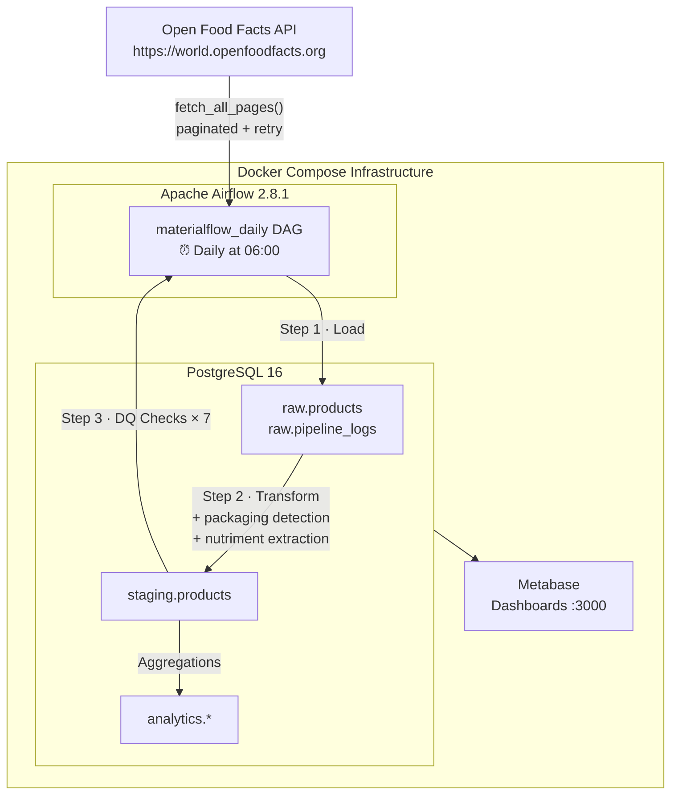
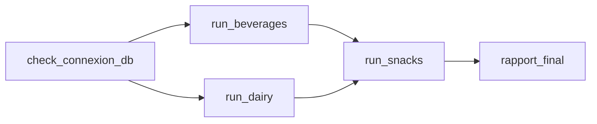

# MaterialFlow

> **Production-grade ELT pipeline for food packaging materials analysis**  
> *Pipeline ELT de production pour l'analyse des matériaux d'emballage alimentaire*

[](https://www.python.org/)
[](https://www.postgresql.org/)
[](https://airflow.apache.org/)
[](https://docs.docker.com/compose/)
[](https://pytest.org/)
[](LICENSE)

🇬🇧 [English](#-overview) · 🇫🇷 [Français](#-présentation)

---

## Overview

**MaterialFlow** is a daily ELT pipeline that extracts food product data from the [Open Food Facts](https://world.openfoodfacts.org/) public API, loads it into a PostgreSQL data warehouse, and transforms it to detect packaging materials (plastic, cardboard, glass, metal) across thousands of products.

The pipeline is orchestrated with **Apache Airflow**, processes **3 food categories in parallel** (beverages, dairy, snacks), and enforces **7 automated data quality checks** on every run.

**Key skills demonstrated:**
- ELT pipeline architecture (raw → staging → analytics layers)
- Apache Airflow DAG with parallel tasks and XCom
- Data quality framework with pass/fail reporting
- Containerized infrastructure with Docker Compose
- 35 unit tests with mocks (ingestion + transformation)

---

## Architecture



### Data Layers

| Layer | Schema | Description |
|-------|--------|-------------|
| **Raw** | `raw.products` | Verbatim API response, stored as-is (TEXT for all fields) |
| **Staging** | `staging.products` | Cleaned, typed data with packaging booleans and parsed nutriments |
| **Analytics** | `analytics.*` | Aggregated views for dashboards and reporting |

---

## Airflow DAG

The `materialflow_daily` DAG runs every day at 06:00 and processes categories in a **parallel-then-sequential** pattern:



| Task | Description |
|------|-------------|
| `check_connexion_db` | Verifies PostgreSQL is reachable before any work |
| `run_beverages` | Full pipeline for the `beverages` category |
| `run_dairy` | Full pipeline for the `dairy` category (parallel with beverages) |
| `run_snacks` | Full pipeline for `snacks` (waits for beverages + dairy) |
| `rapport_final` | Aggregates stats from all categories via XCom |

---

## Tech Stack

| Technology | Version | Role |
|------------|---------|------|
| Python | 3.10 | Core language |
| PostgreSQL | 16 | Data warehouse (raw, staging, analytics) |
| Apache Airflow | 2.8.1 | Pipeline orchestration & scheduling |
| Metabase | latest | Data visualization & dashboards |
| Docker Compose | v2 | Infrastructure management |
| pandas | 2.2.0 | In-memory data transformation |
| SQLAlchemy | 2.0.27 | Database ORM & connection pooling |
| psycopg2 | 2.9.9 | PostgreSQL driver |
| requests | 2.31.0 | HTTP client for Open Food Facts API |
| pytest | — | Unit testing with mocks |

---

## Pipeline Steps

Each `run_pipeline(category)` call executes **5 ordered steps**:

```
[0/5] PostgreSQL connection check
[1/5] API extraction      → fetch_all_pages() with auto-retry (3 attempts, exponential backoff)
[2/5] Raw load            → raw.products (verbatim, with pipeline_run_id metadata)
[3/5] Transformation      → staging.products
         · packaging detection  (plastic / cardboard / glass / metal via keyword matching)
         · nutriment extraction (energy_kcal, fat_g, proteins_g, …)
         · Nutri-Score cleaning (a–e only, NULL otherwise)
         · deduplication on barcode
[4/5] Data quality checks → 7 automated checks (see below)
[5/5] Run logging         → raw.pipeline_logs (status, row counts, DQ summary)
```

Every run returns a stats dict:
```python
{
    "run_id": "run_20260515_060012_beverages",
    "status": "success",          # success | partial | failed
    "rows_extracted": 500,
    "rows_loaded_raw": 500,
    "rows_loaded_staging": 487,
    "rows_rejected": 13,
}
```

---

## Data Quality Checks

7 checks run automatically on the staging DataFrame after each pipeline execution:

| Check | Type | Rule |
|-------|------|------|
| `completude_barcode` | Completeness | 0 NULL barcodes allowed |
| `completude_product_name` | Completeness | ≥ 80% of product names filled |
| `validite_nutriscore` | Validity | Only `a`, `b`, `c`, `d`, `e` or NULL |
| `validite_energy` | Validity | `energy_kcal` between 0 and 9,000 kcal/100g |
| `taux_nutriscore` | Business | ≥ 20% of products have a Nutri-Score |
| `taux_packaging` | Business | ≥ 10% of products have a detected packaging material |
| `volume_staging` | Volume | At least 10 rows loaded in staging for the run |

A run with failing checks gets status `partial` (data is stored but flagged as suspicious).

---

## Project Structure

```
materialflow/
├── dags/
│   └── materialflow_dag.py      # Airflow DAG definition
├── src/
│   ├── config.py                # Typed, immutable config (DatabaseConfig, APIConfig)
│   ├── pipeline.py              # Main ELT orchestrator
│   ├── ingestion/
│   │   └── openfoodfacts.py     # API client with retry & pagination
│   ├── transformation/
│   │   └── products.py          # Cleaning, packaging detection, nutriment extraction
│   ├── loading/
│   │   └── postgres.py          # SQLAlchemy engine, load_dataframe(), run logging
│   └── quality/
│       └── checks.py            # 7 data quality check functions + run_all_checks()
├── sql/
│   ├── 01_create_raw.sql        # raw schema + tables + indexes
│   ├── 02_create_staging.sql    # staging schema + typed columns + constraints
│   └── 03_create_analytical.sql # analytics schema + views
├── tests/
│   ├── test_ingestion.py        # 7 tests — API client with mocks
│   └── test_transformation.py   # 28 tests — transformation functions
├── docker-compose.yml           # PostgreSQL + Airflow + Metabase
├── .env.example                 # Environment variables template
└── requirements.txt             # Python dependencies
```

---

## Getting Started

### Prerequisites

- [Docker](https://docs.docker.com/get-docker/) & Docker Compose v2
- Python 3.10+ (for local development / running tests)

### 1 · Clone & configure

```bash
git clone https://github.com/<your-username>/materialflow.git
cd materialflow

# Copy the environment template
cp .env.example .env
```

Edit `.env` with your values:

```env
POSTGRES_HOST=localhost
POSTGRES_PORT=5432
POSTGRES_DB=materialflow
POSTGRES_USER=materialflow_user
POSTGRES_PASSWORD=your_password
```

### 2 · Start infrastructure

```bash
docker compose up -d
```

This starts 4 services:

| Service | URL | Description |
|---------|-----|-------------|
| PostgreSQL | `localhost:5432` | Data warehouse (auto-initialized via `sql/`) |
| Airflow Webserver | `http://localhost:8080` | DAG UI (admin / admin) |
| Airflow Scheduler | — | Background scheduler |
| Metabase | `http://localhost:3000` | Dashboards |

> The `sql/` scripts run automatically on first PostgreSQL start, creating all schemas and tables.

### 3 · Install Python dependencies

```bash
python -m venv .venv
source .venv/bin/activate        # Windows: .venv\Scripts\activate
pip install -r requirements.txt
```

---

## Usage

### Run the pipeline manually

```python
from src.pipeline import run_pipeline

# Run for a single category
stats = run_pipeline(category="beverages", max_pages=2)
print(stats)
# {'run_id': 'run_20260515_060012_beverages', 'status': 'success',
#  'rows_extracted': 200, 'rows_loaded_raw': 200, 'rows_loaded_staging': 195, ...}
```

Available categories (any Open Food Facts category slug):

```python
run_pipeline("beverages")
run_pipeline("dairy")
run_pipeline("snacks")
run_pipeline("cereals")  # any valid OFF category
```

### Trigger via Airflow

1. Open `http://localhost:8080` (admin / admin)
2. Find the `materialflow_daily` DAG
3. Click **Trigger DAG** to run immediately

---

## Tests

```bash
# Run all tests
pytest tests/ -v

# Run with coverage report
pytest tests/ --cov=src --cov-report=term-missing
```

**Test coverage:**

| Module | Tests | Description |
|--------|-------|-------------|
| `test_ingestion.py` | 7 | API client — HTTP success, timeout, 404, retry logic |
| `test_transformation.py` | 28 | Packaging detection, nutriment extraction, Nutri-Score cleaning, deduplication |
| **Total** | **35** | All passing |

---

---

## Présentation

**MaterialFlow** est un pipeline ELT quotidien qui extrait les données de produits alimentaires depuis l'API publique [Open Food Facts](https://world.openfoodfacts.org/), les charge dans un entrepôt de données PostgreSQL, et les transforme pour détecter les matériaux d'emballage (plastique, carton, verre, métal) sur des milliers de produits.

Le pipeline est orchestré avec **Apache Airflow**, traite **3 catégories alimentaires en parallèle** (boissons, produits laitiers, snacks) et applique **7 checks qualité automatisés** à chaque exécution.

**Compétences démontrées :**
- Architecture pipeline ELT (couches raw → staging → analytics)
- DAG Airflow avec tâches parallèles et communication via XCom
- Framework de qualité de données avec rapport pass/fail
- Infrastructure conteneurisée avec Docker Compose
- 35 tests unitaires avec mocks (ingestion + transformation)

---

## Architecture (FR)

### Couches de données

| Couche | Schéma | Description |
|--------|--------|-------------|
| **Raw** | `raw.products` | Réponse API verbatim, stockée telle quelle (TEXT pour tous les champs) |
| **Staging** | `staging.products` | Données nettoyées et typées, avec booléens d'emballage et nutriments parsés |
| **Analytics** | `analytics.*` | Vues agrégées pour les dashboards et rapports |

---

## Étapes du pipeline (FR)

Chaque appel à `run_pipeline(category)` exécute **5 étapes ordonnées** :

```
[0/5] Vérification connexion PostgreSQL
[1/5] Extraction API      → fetch_all_pages() avec retry automatique (3 tentatives, backoff exponentiel)
[2/5] Chargement RAW      → raw.products (verbatim, avec métadonnées pipeline_run_id)
[3/5] Transformation      → staging.products
         · Détection d'emballage  (plastique / carton / verre / métal par mots-clés)
         · Extraction nutriments  (energy_kcal, fat_g, proteins_g, …)
         · Nettoyage Nutri-Score  (a–e uniquement, NULL sinon)
         · Dédoublonnage sur barcode
[4/5] Checks qualité      → 7 checks automatisés
[5/5] Logging du run      → raw.pipeline_logs (statut, compteurs, résumé DQ)
```

---

## Démarrage rapide (FR)

### Prérequis

- [Docker](https://docs.docker.com/get-docker/) & Docker Compose v2
- Python 3.10+ (pour le développement local / tests)

### 1 · Cloner & configurer

```bash
git clone https://github.com/<votre-username>/materialflow.git
cd materialflow
cp .env.example .env
# Éditer .env avec vos identifiants PostgreSQL
```

### 2 · Démarrer l'infrastructure

```bash
docker compose up -d
```

| Service | URL | Description |
|---------|-----|-------------|
| PostgreSQL | `localhost:5432` | Entrepôt de données (auto-initialisé via `sql/`) |
| Airflow | `http://localhost:8080` | Interface DAG (admin / admin) |
| Metabase | `http://localhost:3000` | Tableaux de bord |

### 3 · Lancer le pipeline

```bash
# Installation des dépendances
python -m venv .venv && source .venv/bin/activate
pip install -r requirements.txt

# Exécution manuelle
python -c "from src.pipeline import run_pipeline; run_pipeline('beverages', max_pages=2)"
```

### 4 · Lancer les tests

```bash
pytest tests/ -v
# 35 passed
```

---

## DAG Airflow (FR)

Le DAG `materialflow_daily` tourne tous les jours à 06:00 avec une topologie **parallèle puis séquentielle** :

- `check_connexion_db` → `[run_beverages, run_dairy]` → `run_snacks` → `rapport_final`

Les catégories `beverages` et `dairy` s'exécutent **en parallèle** pour optimiser le temps de run. `snacks` attend les deux, puis `rapport_final` agrège les statistiques via XCom.

---

*Built with Python, PostgreSQL, Apache Airflow & Docker*
